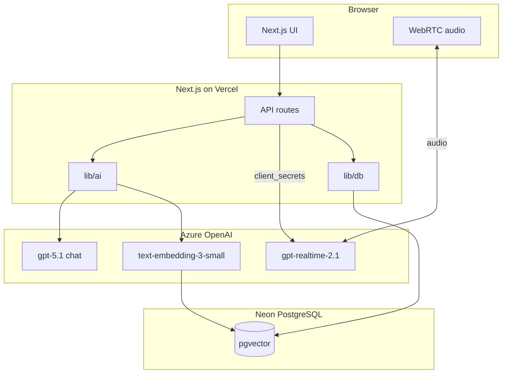

# Namaste Machine Round

Train for the interviewer that isn't human. Namaste Machine Round runs a realistic AI-style screening interview, adapts follow-ups based on your answers, and returns a structured readiness report.

## Architecture

Namaste Machine Round uses a **two-agent design** on a single Next.js app:

- **Interviewer agent** — conducts the live session with adaptive follow-ups (`getAzureChatModel`)
- **Evaluator agent** — reviews the full transcript and generates the readiness report (`getAzureEvaluatorModel`)
- **Voice layer** — real-time speech via Azure OpenAI Realtime API + browser WebRTC (`getAzureRealtimeConfig`)
- **RAG (stretch)** — role-specific question grounding via Neon pgvector + LangChain (`getAzureEmbeddings`, `getSql`)



All AI inference runs exclusively through **Azure OpenAI**. Shared config lives in [`lib/ai/azure-openai.ts`](lib/ai/azure-openai.ts). Database access lives in [`lib/db.ts`](lib/db.ts).

**Session state** is held client-side (React state + transcript). Vercel serverless functions do not share memory across requests.

## Tech stack

| Layer | Choice |
|---|---|
| Framework | Next.js 16 (App Router) + React |
| AI / agents | LangChain.js + `@langchain/openai` (Azure only) |
| Voice | Azure OpenAI Realtime API via **WebRTC** (browser) |
| Database | Neon PostgreSQL + pgvector (`@neondatabase/serverless`) |
| RAG vectors | LangChain `PGVectorStore` (`@langchain/community`) |
| UI | Tailwind CSS + shadcn/ui |
| Hosting | Vercel |

## Prerequisites

- [Bun](https://bun.sh) or Node.js 20+
- Azure OpenAI resource with deployed models:
  - `gpt-5.1` (chat — interviewer + evaluator)
  - `gpt-realtime-2.1` or latest (voice)
  - `text-embedding-3-small` (RAG stretch goal)
- [Neon](https://neon.tech) PostgreSQL database (RAG stretch goal)

## Environment setup

```bash
cp .env.example .env
```

| Variable | Description |
|---|---|
| `AZURE_OPENAI_ENDPOINT` | Azure OpenAI resource endpoint URL |
| `AZURE_OPENAI_API_KEY` | Azure OpenAI API key |
| `AZURE_OPENAI_API_VERSION` | API version for chat + embeddings (e.g. `2025-04-01-preview`) |
| `AZURE_OPENAI_CHAT_DEPLOYMENT` | Chat deployment for interviewer and evaluator |
| `AZURE_OPENAI_REALTIME_DEPLOYMENT` | Realtime deployment for voice |
| `AZURE_OPENAI_EMBEDDING_DEPLOYMENT` | Embeddings deployment for RAG |
| `DATABASE_URL` | Neon PostgreSQL pooler URL (used by the app at runtime) |
| `DIRECT_DATABASE_URL` | Optional Neon direct URL for Prisma migrations (recommended) |

**Only Azure OpenAI is supported for inference.** Do not set `OPENAI_API_KEY`.

### Database setup (Prisma + pgvector)

```bash
bun run db:migrate   # local dev: apply migrations (Prisma generates SQL — never hand-write migrations)
bun run db:deploy    # CI/production: apply pending migrations
bun run db:seed      # seeds roles + RAG question bank
```

`db:migrate` prefers `DIRECT_DATABASE_URL` when set; otherwise it uses `DATABASE_URL`.

Schema changes: edit `prisma/schema.prisma`, then run `bun run db:migrate`. Do not create files under `prisma/migrations/` manually.

### API smoke checks (PRD §6.4)

```bash
bun run dev
bun run smoke:api
bun run smoke:frontend
```

Acceptance checklist before submission:
1. Cold start: incognito session completes interview + report in under 3 minutes
2. Five consecutive runs without manual intervention
3. App works when database is unavailable (client sessionStorage fallback)
4. Evaluate request fails gracefully within the 60s budget
5. At least one adaptive follow-up includes `referencedAnswer`
6. Share token URL returns the same report JSON and renders at `/report/share/[token]`
7. Realtime route returns `client_secret` when Azure is configured
8. Voice mode establishes WebRTC audio and appends transcripts to the session
9. Replay page loads at `/replay/[publicId]` for persisted sessions
10. Readiness report can be copied via share link and downloaded as PDF

Optional admin reseed (requires `ADMIN_SECRET`):

```bash
curl -X POST http://localhost:7329/api/admin/reseed-questions -H "x-admin-secret: $ADMIN_SECRET"
```

## Getting started

```bash
bun install
bun dev
```

Open [http://localhost:7329](http://localhost:7329).

The dev server always uses port **7329**. `bun dev` frees that port first if something is already listening.

## Module usage

### AI (Azure OpenAI)

```typescript
import {
  getAzureChatModel,
  getAzureEvaluatorModel,
  getAzureEmbeddings,
  getAzureRealtimeConfig,
} from "@/lib/ai";

const interviewer = getAzureChatModel();
const evaluator = getAzureEvaluatorModel();
const embeddings = getAzureEmbeddings();
const realtime = getAzureRealtimeConfig();
// realtime.clientSecretsUrl — server mints ephemeral key for browser WebRTC
// realtime.callsUrl — browser WebRTC call endpoint
```

### Database (Prisma + Neon)

```typescript
import { prisma } from "@/lib/prisma";

const roles = await prisma.role.findMany();
```

For raw SQL (e.g. LangChain pgvector), use the pooler connection:

```typescript
import { getSql } from "@/lib/db";

const sql = getSql();
```

### RAG (stretch goal)

Use `PGVectorStore` from `@langchain/community/vectorstores/pgvector` with `getAzureEmbeddings()` and your `DATABASE_URL` pooler connection.

## Voice flow (WebRTC)

Next.js on Vercel does not support persistent WebSocket servers. Voice uses **WebRTC** instead:

1. Browser calls `POST /api/realtime/session` (Next.js API route)
2. Server exchanges `AZURE_OPENAI_API_KEY` for an ephemeral token via `client_secrets`
3. Browser connects audio directly to Azure via WebRTC (`/openai/v1/realtime/calls`)
4. Text input remains available as fallback

No WebSocket proxy or extra voice packages required.

## Project structure

```
app/                  # Next.js pages and API routes
components/           # UI components (shadcn/ui)
lib/
  ai/                 # Azure OpenAI config and model factories
  db.ts               # Neon serverless client
```

## Design system

Namaste Machine Round uses the **NamasteDev design system** ([namastedev.com](https://namastedev.com)):

- Dark-first theme (`#030303` background, `#F7F4EE` text)
- Maven Pro headings + Inter body
- Orange accent `#E58C33` for CTAs, badges, and progress
- Dot-grid hero background and Codex-style terminal panels

Tokens live in [`lib/design/tokens.ts`](lib/design/tokens.ts) and [`app/globals.css`](app/globals.css).

## App routes

| Route | Purpose |
|---|---|
| `/` | Landing page |
| `/interview` | Role selection |
| `/interview/session` | Live interview (text + voice) |
| `/report` | Readiness report |
| `/report/share/[token]` | Public shared readiness report |
| `/replay/[publicId]` | Session transcript replay |

## RAG seed (stretch)

```bash
bun run seed:questions
```

Requires Neon `DATABASE_URL` and `CREATE EXTENSION vector`.

## Deploy on Vercel

1. Push to GitHub and import the repo on Vercel
2. Set all seven environment variables from `.env.example`
3. Deploy — no separate backend host needed

## Cut order (if behind schedule)

Per the PRD: RAG → voice → report polish → pitch deck. The text-based interview loop + report is the floor.
